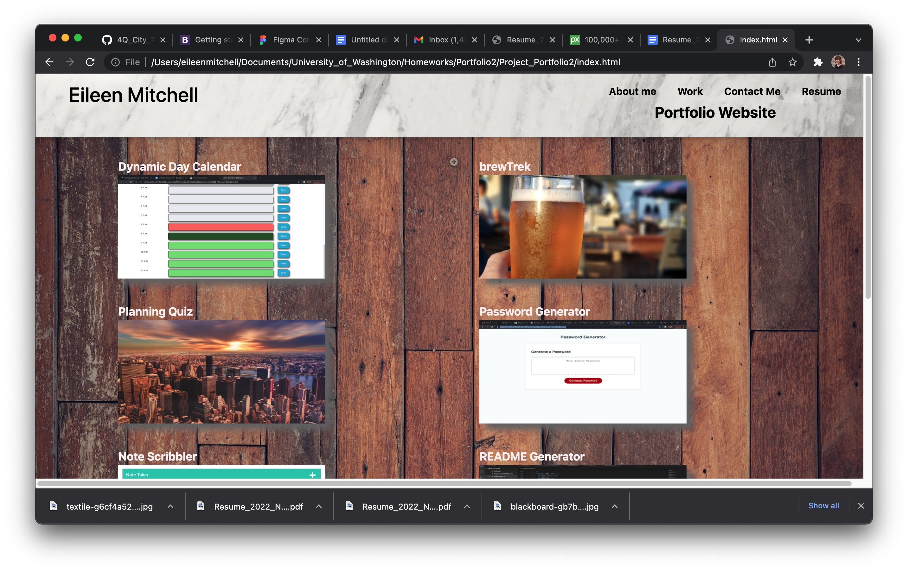
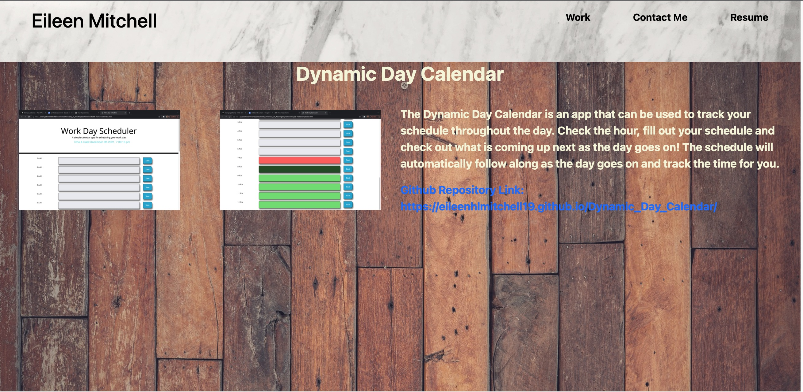

# SOFTWARE DEVELOPMENT PORTFOLIO

By: Eileen Mitchell
-A Portfolio of most recent projects

## Technologies Used
-HTML
-CSS

## Link to Website URL
https://eileenhlmitchell19.github.io/Project_Portfolio2/

## Description
This website allows users to brows through my growing portfolio of coding projects. The project portfolio is a second attempt at my original portfolio website, with a new layout, code updates, bug fixes and additional material.

In order to scroll to work, just click on the item you are looking for on the top right hand corner of the screen. For example, if you would like to review my work portfolio, click work in the right hand corner and it will automatically take you to the work section of my page. 

To view my work, click on the image tags which will take you directly to relevant project pages. These pages house a project summary and information on the project, the links to the github repository and website link. This will continue to be updated as more projects are created.

## Known Bugs and Future Improvements
More work will be done in the future to choose a theme for the page and continue to style the page. As more projects are added, the projects page will need to be expanded. 

# MIT License

Copyright (c) 2022 Eileen HL Mitchell

Permission is hereby granted, free of charge, to any person obtaining a copy
of this software and associated documentation files (the "Software"), to deal
in the Software without restriction, including without limitation the rights
to use, copy, modify, merge, publish, distribute, sublicense, and/or sell
copies of the Software, and to permit persons to whom the Software is
furnished to do so, subject to the following conditions:

The above copyright notice and this permission notice shall be included in all
copies or substantial portions of the Software.

THE SOFTWARE IS PROVIDED "AS IS", WITHOUT WARRANTY OF ANY KIND, EXPRESS OR
IMPLIED, INCLUDING BUT NOT LIMITED TO THE WARRANTIES OF MERCHANTABILITY,
FITNESS FOR A PARTICULAR PURPOSE AND NONINFRINGEMENT. IN NO EVENT SHALL THE
AUTHORS OR COPYRIGHT HOLDERS BE LIABLE FOR ANY CLAIM, DAMAGES OR OTHER
LIABILITY, WHETHER IN AN ACTION OF CONTRACT, TORT OR OTHERWISE, ARISING FROM,
OUT OF OR IN CONNECTION WITH THE SOFTWARE OR THE USE OR OTHER DEALINGS IN THE
SOFTWARE.

# Photos of Website

