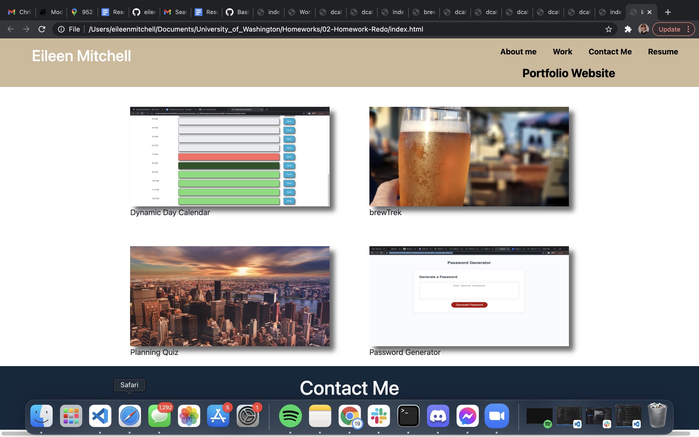
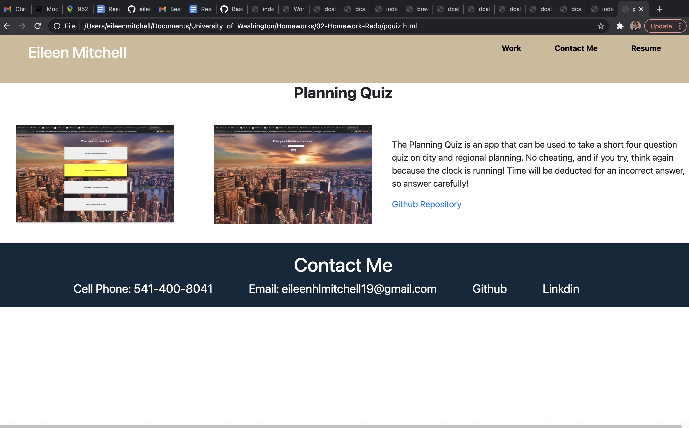
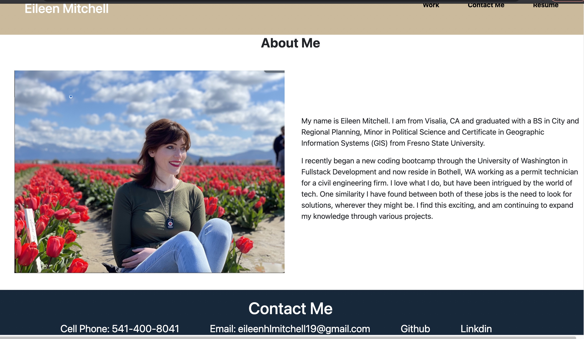

# SOFTWARE DEVELOPMENT PORTFOLIO

By: Eileen Mitchell
-A Portfolio of most recent projects

## Technologies Used
-HTML
-CSS

## Link to Website URL
https://eileenhlmitchell19.github.io/Project_Portfolio2/

## Description
This website allows users to brows through my growing portfolio of coding projects. The project portfolio is a second attempt at my original portfolio website, with a new layout, code updates, bug fixes and additional material.

In order to scroll to work, just click on the item you are looking for on the top right hand corner of the screen. For example, if you would like to review my work portfolio, click work in the right hand corner and it will automatically take you to the work section of my page. 

To view my work, click on the image tags which will take you directly to relevant project pages. These pages house a project summary and information on the project, the links to the github repository and website link. This will continue to be updated as more projects are created.

## Known Bugs and Future Improvements
More work will be done in the future to choose a theme for the page and continue to style the page. As more projects are added, the projects page will need to be expanded. 

